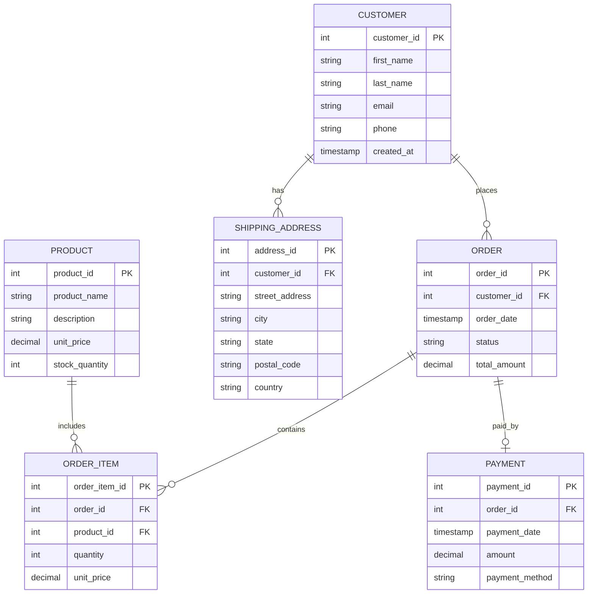

# Entity Relationship Diagram

## Mermaid ERD

## Relationship summary
- One customer can place many orders.
- One order can contain many order items.
- One product can appear in many order items.
- One order may have one payment record.
- One customer can have multiple shipping addresses.

## Notes
This design is suitable for a basic e-commerce or retail management database.
